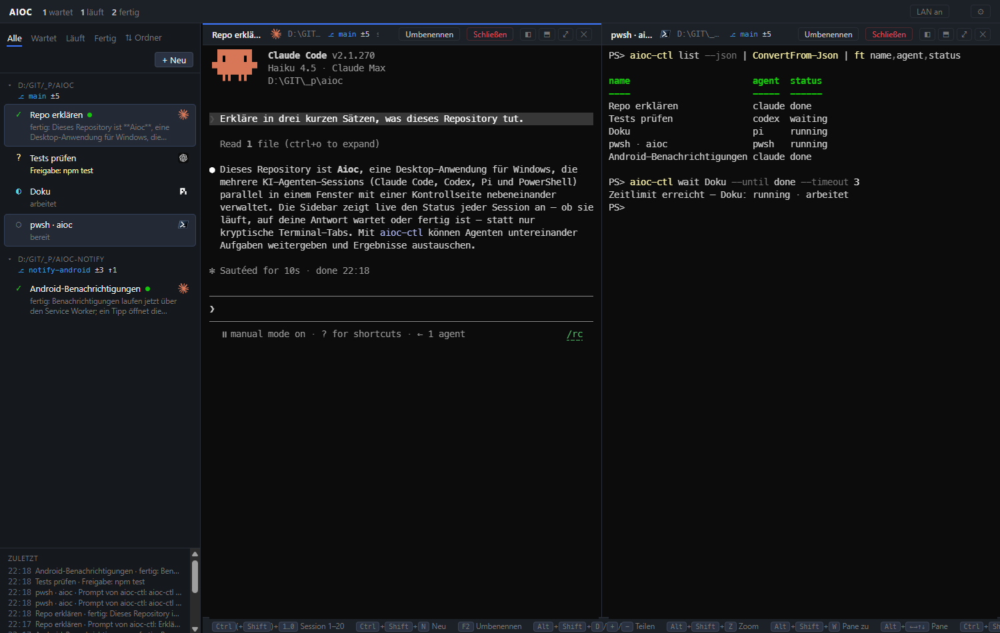

# Aioc

**One window for all your AI coding agents.**

Aioc runs any number of [Claude Code](https://code.claude.com), [Codex](https://github.com/openai/codex) and [Pi](https://github.com/earendil-works/pi) sessions — plus plain PowerShell — side by side in a single desktop window, with a sidebar that tells you at a glance **which agent is working, which one is waiting for your answer, and which one is done.**



## Why

Once you run four, six, eight agent sessions in parallel, terminal tabs stop working. Every tab looks the same, and the one that has been silently waiting for your approval for ten minutes looks exactly like the one that is still busy. Aioc turns that pile of tabs into a control room: real terminals on the right, a live status board on the left.

The status is **not guessed from screen output**. Each agent reports it through its own hook or extension mechanism, injected per launch — so it is exact, and your global agent configuration stays untouched.

## What Aioc does

- **Real terminals.** Every session is a genuine ConPTY terminal rendered with xterm.js. Fullscreen TUIs, colors, Nerd Font glyphs, mouse, scrollback, search — everything behaves as it does in Windows Terminal.
- **Live status per session.** `running` · `waiting for you` (questions, permission prompts, approval overlays) · `done` (with an unread marker until you look) · `idle` · `exited`. Counters in the title bar, an event feed, filters for *waiting / running / done*.
- **Exact status sources.** Claude Code hooks (via `--settings`), Codex hooks (via `-c`), a tiny Pi extension (via `-e`), the terminal title as a second, independent source, and an activity heuristic for plain shells. All of it is passed on the command line of the individual session.
- **Daemon and window are separate.** A small background service owns the sessions. Closing the window — or crashing it, or updating Aioc — never kills an agent. Reopen the window and everything is still there, scrollback included.
- **Survives reboots.** Session list and scrollback are persisted continuously. After a restart every session comes back as *"before restart"* with its full terminal content; one click resumes the agent's own conversation (`claude --resume`, `codex resume`, `pi --session`) using the IDs Aioc learned from the hooks. Only a turn that was mid-flight at shutdown is lost.
- **Built for many sessions.** Split panes freely — right, down, as deep as you like, drag the dividers, zoom one pane to the full area. Plus folder groups you can collapse, sort by folder or by status, a resizable sidebar, remembered window position, and Windows-Terminal-style keys.
- **The UI is a web app.** The daemon serves it; Electron is just the shell around it. Switch on **LAN** and the same UI runs on a laptop, a tablet (as a PWA) or a second PC — over HTTPS/WSS with a pinned certificate (see [Use it from another machine](#use-it-from-another-machine-lan)).
- **Every pane has its own header.** In split view each terminal carries name, agent, folder, branch, session ID and its own actions.
- **Branch at a glance.** Folder headings and pane headers show the git branch and the working tree, e.g. `⎇ main ±3 ↑1` (changes · ahead · behind). Read-only, and always with `--no-optional-locks`, so Aioc never takes the index lock away from an agent that is committing.
- **Names stay in sync, both ways.** Rename a session inside Claude Code or Codex with `/rename` and Aioc picks it up; rename it in Aioc with F2 and Aioc sets it in the agent. Without a name of your own, Aioc follows Claude's own session title too (see [Session names](#session-names)).
- **A control CLI for scripts and agents.** `aioc-ctl` lists sessions, reads a terminal as plain text, sends a prompt, answers a dialog and waits for the result — so one agent can hand work to another. See [Scripting](#scripting-aioc-ctl).

## What Aioc deliberately does not do

- **No git automation.** No worktree creation, no branch juggling, no fanning one prompt out to five agents, no merging. Aioc *shows* branch and working-tree state and never runs a git command that writes. Aioc knows your folders — you keep control of your repositories.
- **No diff review, no editor, no embedded browser.** Aioc is terminals plus overview. Nothing else.
- **No changes to `~/.claude`, `~/.codex` or `~/.pi`.** Everything Aioc needs is injected per session start. Your existing hooks, settings and extensions keep working exactly as before.
- **No cloud, no accounts, no telemetry.** Everything lives on your machine under `%USERPROFILE%\.aioc`.
- **No agents starting behind your back.** After a reboot Aioc shows you what was running and lets you decide, per click, what to resume.

## Quick start

Requirements: Windows 10/11 · [Node.js](https://nodejs.org) ≥ 20 (developed on 26) · the agents you want on your `PATH` (`claude`, `codex`, `pi`) · PowerShell 7 (`pwsh`) for shell sessions. Pi needs ≥ 0.84.4 for its *waiting* events.

```powershell
git clone https://github.com/ma-schulz/aioc.git
cd aioc
npm install        # node-pty (prebuilt, no compiler needed), xterm.js, Electron
.\aioc.cmd         # starts the daemon if needed and opens the window
```

Click **+ Neu**, pick an agent and a folder, and you have your first session. The user interface is in German.

Other ways to run it:

```powershell
npm run daemon     # daemon only (e.g. for autostart)
npm run app        # window only
.\aioc-restart.cmd # restart the daemon after an update — sessions come back as "before restart"
```

Browser instead of Electron: open `http://127.0.0.1:43117/?token=<token>` — the token is in `%USERPROFILE%\.aioc\daemon.json`.

## Everyday use

| Key | Action |
| --- | --- |
| `Ctrl+Shift+N` | New session |
| `Ctrl+1 … 9` | Switch to the n-th session in the list — loads it into the focused pane, or moves focus to the pane that already shows it |
| `F2` / `Ctrl+Shift+R` | Rename the current session (Enter saves, Esc cancels) — the name is set inside the agent as well (Claude Code, Codex) |
| `Alt+Shift+D` | Split the focused pane along its longer side |
| `Alt+Shift++` / `Alt+Shift+-` | Split to the right / split downwards |
| `Alt+Shift+Z` | Zoom the focused pane to the full area (again: back) |
| `Alt+Shift+W` | Close the pane — the session keeps running and stays in the list |
| `Alt+← → ↑ ↓` | Move focus to the neighbouring pane (like Windows Terminal) |
| `Shift+Enter` | New line in the agent's prompt without submitting (Claude Code, Codex, Pi) |
| `Ctrl+Shift+F` | Search in the current terminal |
| `Ctrl+C` / `Ctrl+V` | Copy when text is selected (otherwise sends the interrupt) / paste — text is pasted, an **image** in the clipboard is handed to the agent (Claude Code, Codex) |
| Right click | Copy the selection, or paste if nothing is selected |

- Click a pane to focus it; the sidebar always loads sessions into the focused pane.
- Click a folder heading to collapse the group. Collapsed groups show `?` (waiting) and `●` (unread) as a hint.
- The `⇅` switch sorts by folder (grouped) or by status (waiting first, flat).
- Drag a session by its `⠿` handle (or anywhere in the row, with the mouse) to reorder it inside its folder group — the folder belongs to the session, so it stays in its group. The order lives in the daemon, so every window and every device shows the same one. Sorting by status is by status, so dragging is off there.
- Drag the divider to resize the sidebar; double-click resets it. The same works for the dividers between panes — double-click puts them back to half and half.
- Each pane header carries its own buttons: **◧** split right, **⬒** split down, **⤢** zoom, **✕** close the pane.
- Double-click a session name (in the sidebar or in the header) to rename it.
- **⚙ Background image and per-device settings:** pick an image (stored by the daemon, so remote windows show it too), and set opacity and terminal font size for *this* device — like `backgroundImage` in Windows Terminal.
- **Close** ends the process (asks first). **Remove** deletes an exited session and its scrollback from the list.

### After a reboot

Start Aioc. Every previous session is listed as *"vor Neustart · wiederherstellbar"* with its full scrollback. Click **Wiederherstellen** on a session (or **Alle wiederherstellen** at the top of the list) to relaunch the agent in the same folder with its previous conversation.

### Autostart

`install-autostart.cmd` registers the daemon as a scheduled task that starts hidden at logon; `remove-autostart.cmd` removes it. The window itself is started with `aioc.cmd` whenever you need it.

## How the status is detected

| Agent | Injected per launch | Signals |
| --- | --- | --- |
| Claude Code | `--settings %USERPROFILE%\.aioc\claude-settings.json` — hooks run **in addition** to your global and project hooks | `UserPromptSubmit`, `PreToolUse` (AskUserQuestion), `PermissionRequest`, `Notification`, `Stop`, `SessionStart/End`; title spinner as second source |
| Codex | `-c "hooks.<Event>=[…]"` plus `--dangerously-bypass-hook-trust` (see note) | `UserPromptSubmit`, `PermissionRequest`, `Stop`, `SessionStart`; the `Action Required` terminal title for approval overlays |
| Pi | `-e daemon/hooks/aioc-pi-ext.ts` | `agent_start`, `agent_settled`, `ui_prompt_start/end`, `session_start` (with session ID) |
| pwsh / anything else | — | output flowing → running, 3 s quiet → idle, process exit → exited |

The hooks are a 20-line script that reads the hook JSON from stdin and posts it to the daemon on `127.0.0.1`, tagged with the session ID from the environment. It never blocks the agent and always exits 0.

### Session names

Aioc keeps the session name in sync with the agent. Claude Code writes its session name into the terminal title (`✳ Blau-Test`, and `◐ Blau-Test` while it works), so a `/rename` inside Claude shows up in Aioc a moment later. Until you name a session yourself, Aioc follows Claude's own generated title too — a fresh `claude · myrepo` turns into what the session is actually about.

A name **you** set in Aioc (F2) is never overwritten by a generated title. Only a later `/rename` inside the agent beats it, because that one is newer and explicitly yours. To tell the two apart, Aioc reads Claude's own session registry (`~/.claude/sessions/<pid>.json`: `name`, `nameSource` — `user` vs `derived` — and `nameSince`). Claude writes that file a moment after the title, so Aioc re-checks twice before giving up; if the file is missing or its format changes, Aioc simply falls back to the title.

Codex writes its thread name into the title as `<name> | <folder>`, and it only ever puts a name there once you renamed the thread. So in Codex any name in the title counts as yours and replaces a name you gave in Aioc.

It works in the other direction as well: what you type into F2 is set inside the agent, via `/rename` in Claude Code and in Codex. Aioc waits for a quiet moment before typing — never into a running turn, never into an open question — so a rename you trigger while an agent is working arrives the moment it is done. Codex reports its session start only with the first prompt, so a freshly started Codex session is renamed as soon as its TUI is up.

Titles that are not names stay out: `Claude Code`, Codex' bare folder title, the path PowerShell prompts write. Hover a name to see the agent's raw title.

**Note on Codex:** Codex asks once whether it may run newly configured hooks — and that dialog is one-shot. If it is dismissed, the hooks are silently never executed. Because the only hooks involved are Aioc's own command-line injections, Aioc starts Codex with `--dangerously-bypass-hook-trust`. If you keep your own hooks in `~/.codex/hooks.json`, be aware that this flag covers them too.

## Scripting (`aioc-ctl`)

Sessions can be driven from the command line — by your own scripts, and by the agents themselves. `bin\` is prepended to the `PATH` of Aioc sessions only, so inside any Aioc session `aioc-ctl` is simply there; nothing is installed globally and no agent configuration is touched.

```powershell
aioc-ctl list                                   # all sessions with status, folder and branch
aioc-ctl read <session> [--lines N|--all]       # terminal content as plain text
aioc-ctl read <session> --answer                # the agent's last answer (Claude, Codex)
aioc-ctl prompt <session> "<text>" --wait       # type, submit, wait for the turn, print the answer
aioc-ctl key <session> enter                    # keys: enter esc tab up down ctrl+c … or one character
aioc-ctl wait <session> [--until done,waiting]  # block until the session reaches one of these states
```

`<session>` is an ID, a name, a unique part of a name, or `self` for the calling session. `--json` prints machine-readable output. Exit codes: `0` ok, `1` error, `2` wrong usage, `124` timeout. Text that would fight with shell quoting goes in through stdin: `"…" | aioc-ctl prompt build -`.

So one agent can hand work to another and pick up the result:

```powershell
aioc-ctl prompt tests "Run the failing test and name the root cause in two sentences." --wait --timeout 900
```

Input sent this way counts as answered only once the agent has actually started working, so `--wait` can never return the *previous* turn's "done" — Codex, for instance, reports `SessionStart` (→ *idle*) only when it receives its first prompt. If the agent stops with a question instead, `wait` returns `waiting`, `aioc-ctl read` shows the dialog and `aioc-ctl key` answers it.

Whatever arrives this way is visible to you: the event feed shows `Prompt von <session>` with the first few words, exactly like any other status change.

Under the hood this is a small HTTP API on the daemon (`/api/…`). It accepts **loopback connections only**, is refused on the LAN listener, and always needs the token from `daemon.json` — writing into a terminal is full access to the machine.

## Use it from another machine (LAN)

The window is only a client, so it can run somewhere else — a laptop, a tablet, a second PC.

1. On the daemon machine click **LAN an** in the title bar. Aioc generates a self-signed certificate once (`%USERPROFILE%\.aioc\tls\`) and opens a second listener: **HTTPS/WSS on port 43443**, bound to all interfaces. The switch is persistent; `node daemon/lan.js on|off|status` does the same from the command line.
2. Allow the port in Windows Firewall once (as administrator): `netsh advfirewall firewall add rule name="Aioc LAN" dir=in action=allow protocol=TCP localport=43443`
3. Click **Link kopieren**. The link carries the access token and the certificate fingerprint, e.g. `https://192.168.1.10:43443/?token=…#fp=…` (no `&` or `%`, so it survives an unquoted command line).
4. On the other device:
   - **Phone / tablet:** click **QR fürs Handy**, scan the code (same Wi-Fi), accept the self-signed certificate once, and use *Add to Home Screen* — Aioc ships a PWA manifest whose start URL carries the token, so the installed app opens straight into your sessions. On narrow screens Aioc shows the session list first; tapping a session opens its terminal full-screen, **‹ Liste** goes back.
   - **Second PC with this repo:** `aioc-remote.cmd "<link>"` opens an Aioc window that pins the daemon's certificate to the fingerprint from the link — no certificate warning, and any other certificate is rejected.

Pasting an image from a remote window works too: the image travels over the WebSocket to the daemon, is placed in the clipboard of the daemon machine and handed to the agent there — the same path a local `Ctrl+V` takes. **LAN aus** closes the listener and drops remote clients; local use continues untouched.

### Several windows at once

All clients load the same web UI, but each one keeps its own view: pane layout and split state, filter, sort order, collapsed groups, sidebar width, font size and background opacity live in that device's browser storage (the background image itself is stored by the daemon). Sessions, status, scrollback, names and unread markers are shared and pushed live to everyone, so you can work on different sessions from different devices in parallel.

The one thing a session cannot have twice is its terminal size. When two clients show the same session, the **smallest current viewer sets the size** (as in tmux) and the header shows who is limiting it, e.g. `⧉ Größe: Handy 60×20`. As soon as that client leaves the session — back to the list, another session, connection closed — the limit is lifted immediately and the larger window gets its size back.

## Security

- Locally the daemon listens on `127.0.0.1` only. The LAN listener is off until you switch it on, uses TLS, and every WebSocket connection needs the token.
- A terminal is full access to your machine. Keep the link private, and never expose the port beyond your LAN — use a VPN (Tailscale, WireGuard) instead of port forwarding.
- The hook endpoint (`/event`) accepts loopback connections only, on both listeners.
- The control API (`/api/…`, used by `aioc-ctl`) is loopback-only too **and** needs the token; it is refused on the LAN listener even when the request comes from `127.0.0.1`.

## Project layout

```
daemon/        the service: PTYs (node-pty/ConPTY), scrollback (headless xterm),
               status engine, persistence, hook endpoint, WebSocket protocol,
               control API (api.js) and branch/working-tree state (git.js, read-only)
daemon/hooks/  agent-hook.js (Claude/Codex relay), aioc-pi-ext.ts (Pi extension)
cli/ + bin/    aioc-ctl — bin/ is prepended to the PATH of Aioc sessions
ui/            the web app the daemon serves (vanilla JS + xterm.js)
shell/         the Electron shell (starts the daemon if needed, loads the UI)
```

State lives in `%USERPROFILE%\.aioc\`: `sessions.json`, `scrollback\`, `daemon.json`, `window.json`, the generated `claude-settings.json`. Set `AIOC_HOME` (and `AIOC_DAEMON_PORT`) to run a second, fully isolated profile — handy for testing.

## License

[MIT](LICENSE)
